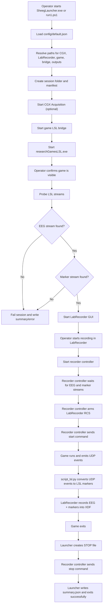
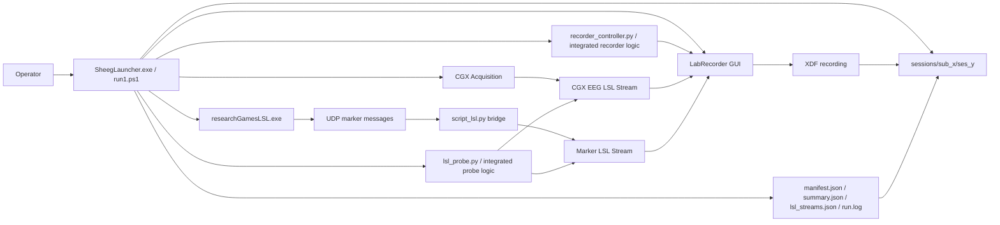

# Sheeg Software Flow

This document describes how the Sheeg software currently runs, including:

- runtime flow
- component interactions
- data flow between CGX, the game, LSL, LabRecorder, and session outputs

## Main Runtime Entry Points

There are two operator-facing launch paths:

- `run1.ps1`
- `SheegLauncher.exe` / `sheeg_launcher.py`

The final packaged release path is based on:

- `sheeg_launcher.py`

That launcher contains the logic for:

- full session orchestration
- UDP-to-LSL marker bridge
- LSL stream probing
- LabRecorder control

## Flow Chart



## Block Diagram



## Detailed Execution Steps

### 1. Configuration

The launcher reads:

- `config/default.json`

Important values:

- protocol name
- output root
- expected EEG stream name
- expected marker stream name
- CGX path settings
- LabRecorder path settings
- game executable path
- game LSL bridge path

### 2. Session Setup

The launcher creates a session directory like:

- `sessions/sub_<subject>/ses_<session_id>`

It then writes:

- `manifest.json`
- `run.log` or equivalent session logs

### 3. CGX Acquisition

If enabled in config:

- the launcher starts CGX Acquisition
- waits for the configured pre-roll period

This is expected to produce the EEG LSL stream.

### 4. Game Marker Bridge

The launcher starts:

- `scripts/GameScript/script_lsl.py`

This component:

- listens for UDP marker messages from the game
- converts them into an LSL marker stream

Typical marker stream metadata:

- stream type: `Markers`
- stream name: detected marker stream such as `MarkerStream`

### 5. Game Execution

The launcher starts:

- `scripts/GameScript/researchGamesLSL.exe`

This game:

- runs the task
- emits UDP messages for task events

Those UDP events are consumed by `script_lsl.py`, which publishes them into LSL.

### 6. LSL Probe

The launcher probes for both:

- EEG stream from CGX
- marker stream from the game bridge

Probe responsibilities:

- detect EEG stream
- detect marker stream
- report whether each was found
- save `lsl_streams.json`

If either required stream is missing, the session fails early.

### 7. LabRecorder

Once both LSL streams are confirmed:

- LabRecorder GUI is started
- the operator confirms recording has started

LabRecorder should record:

- CGX EEG stream
- marker LSL stream

### 8. Recorder Controller

The launcher starts recorder control logic.

Responsibilities:

- wait until both EEG and marker streams are visible
- connect to LabRecorder Remote Control Server
- send start command
- wait for stop signal
- send stop command

This is the step that ensures both streams are recorded together into the same XDF.

### 9. Session End

When the game exits:

- launcher creates a `STOP` file
- recorder controller notices `STOP`
- recorder controller sends LabRecorder stop command
- launcher writes `summary.json`

## Data Flow

### EEG Path

```text
CGX Acquisition
  -> LSL EEG stream
  -> LabRecorder
  -> XDF file
```

### Marker Path

```text
researchGamesLSL.exe
  -> UDP marker messages
  -> script_lsl.py
  -> LSL marker stream
  -> LabRecorder
  -> XDF file
```

### Metadata / Session Files

```text
Launcher
  -> manifest.json
  -> lsl_streams.json
  -> summary.json
  -> run.log
```

## Important Components

### `run1.ps1`

Legacy script-based orchestration entry point.

Responsibilities:

- resolve config
- create session folder
- start CGX
- start bridge
- start game
- probe LSL
- start LabRecorder
- start recorder controller
- stop everything cleanly

### `sheeg_launcher.py`

Packaged release entry point for the final EXE.

Contains subcommands for:

- `main`
- `bridge`
- `probe`
- `recorder`

### `script_lsl.py`

Game marker bridge.

Responsibilities:

- listen on UDP
- publish marker events into LSL

### `lsl_probe.py`

Stream validation layer.

Responsibilities:

- detect EEG stream
- detect marker stream
- save stream discovery report

### `recorder_controller.py`

LabRecorder control logic.

Responsibilities:

- wait for EEG and marker streams
- connect to RCS
- start recording
- stop recording

## Common Failure Points

- CGX cannot be launched automatically due to permissions
- game LSL bridge is not started
- game emits UDP but bridge is not publishing markers
- EEG stream is present but marker stream is missing
- LabRecorder RCS is not reachable
- recorder controller exits due to missing streams or bad arguments

## Summary

The system is a coordinated acquisition pipeline:

1. Start hardware acquisition
2. Start marker bridge
3. Start game
4. Verify both EEG and marker streams
5. Start LabRecorder
6. Control recording lifecycle
7. Save one XDF containing both EEG and markers

That is the core operational design of the Sheeg software.
